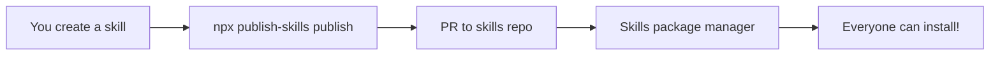

<div align="center">

# 🚀 publish-skills

[](https://www.npmjs.com/package/publish-skills)
[](LICENSE)
[](https://github.com/your-username/publish-skills/actions)
[](https://prettier.io)

**Publish AI agent skills to Git repositories in one command.**

</div>

---

## ⚡ Quick Start

```bash
npx publish-skills publish
```

That's it! Your skill is now a Pull Request away from being shared with the world.

---

## 🎯 What Does It Do?

`publish-skills` bridges the gap between **creating** AI agent skills and **sharing** them with the community.

### The Magic Combo: `publish-skills` + `skills`

| Step | Tool               | What It Does                                             |
| ---- | ------------------ | -------------------------------------------------------- |
| 1️⃣   | **publish-skills** | 📤 Publish your skill to a Git repository via PR/MR      |
| 2️⃣   | **skills** (npx)   | 🔍 Discover, download & install skills from the registry |



**Together, they create a complete ecosystem:**

- **Publish** your skills once with `publish-skills`
- **Share** them via a central Git repository
- **Discover** them with `npx skills search <topic>`
- **Install** them with `npx skills install <skill-name>`

---

## 📦 What's a Skill?

A **skill** is a reusable package of prompts, templates, and configurations that supercharge AI agents like Claude, Gemini, and Cline.

```
my-awesome-skill/
├── SKILL.md           # 📋 Metadata (name, version, agents supported)
├── manifest.json      # ⚙️  Agent compatibility config
├── README.md          # 📖 Usage instructions
└── content/
    ├── prompts/       # 💬 Prompt templates (.md files)
    ├── templates/     # 📄 Code/config templates
    └── resources/     # 🖼️  Images, diagrams, etc.
```

---

## 🎨 Commands at a Glance

```bash
# 🏗️  Create a new skill from template
npx publish-skills create

# ✅ Validate your skill before publishing
npx publish-skills validate [path]

# 🚀 Publish your skill (creates PR/MR)
npx publish-skills publish [skill-path]

# 🔐 Login/Logout to Git platforms
npx publish-skills login
npx publish-skills logout

# ⚙️  Manage configuration
npx publish-skills config list
npx publish-skills config set <key> <value>
```

---

## 🔧 How It Works

### 1. **Create** Your Skill

```bash
npx publish-skills create
```

Interactive wizard guides you through:

- Skill name & description
- Target AI agents (Claude, Gemini, Cline)
- License selection

### 2. **Build** Your Skill

Add prompts, templates, and resources to the generated structure. Edit `SKILL.md` and `manifest.json` to configure agent compatibility.

### 3. **Publish** Your Skill

```bash
npx publish-skills publish
```

The tool:

1. ✅ Validates your skill structure
2. 🔐 Loads your Git credentials
3. 📥 Clones the target repository
4. 🌿 Creates a feature branch
5. 📁 Copies your skill to `skills/<your-skill>/`
6. 💾 Commits with a clear message
7. 🚀 Pushes the branch
8. 🔀 Opens a Pull/Merge Request
9. 🎉 Displays the PR URL

### 4. **Share** with the World

Once your PR is merged, anyone can install your skill:

```bash
npx skills install your-skill-name
```

---

## 📋 The manifest.json File

The `manifest.json` file tells agent runtimes (Claude, Gemini, Cline) **how to install and use** your skill.

```json
{
  "name": "my-skill",
  "version": "1.0.0",
  "agents": {
    "claude": {
      "supported": true,
      "installPath": "~/.claude/skills/",
      "setupScript": "setup.sh"
    },
    "gemini": {
      "supported": true,
      "installPath": "~/.gemini/skills/"
    },
    "cline": {
      "supported": false
    }
  }
}
```

**Key fields:**

- `agents.*.supported` - Which AI agents can use this skill
- `agents.*.installPath` - Where the agent should install the skill
- `agents.*.setupScript` - Optional script to run after installation

This allows `npx skills install` to automatically place skills in the correct location for each agent.

---

## 🛠️ Setup & Configuration

### First-Time Setup

```bash
# 1. Login to your Git platform (GitHub/GitLab/Bitbucket)
npx publish-skills login

# 2. Configure the target repository
# Example for GitHub:
npx publish-skills config set repositories.default.url https://github.com/your-org/skills-repo
# Example for GitLab:
npx publish-skills config set repositories.default.url https://gitlab.com/your-group/skills-repo
# Example for Bitbucket:
npx publish-skills config set repositories.default.url https://bitbucket.org/your-team/skills-repo

# 3. Publish your first skill!
npx publish-skills publish ./my-skill
```

### Configuration File

Settings stored at `~/.publish-skills/config.json`:

```json
{
  "author": {
    "name": "Your Name",
    "email": "you@example.com"
  },
  "repositories": {
    "default": {
      "platform": "github",
      "url": "https://github.com/your-org/skills-repo",
      "targetBranch": "main",
      "skillsPath": "skills/"
    }
  },
  "defaultRepository": "default"
}
```

---

## 🌟 Why Use publish-skills?

| ✅ Feature                 | Benefit                                    |
| -------------------------- | ------------------------------------------ |
| **One-command publishing** | No manual Git operations                   |
| **Multi-platform**         | GitHub, GitLab, Bitbucket                  |
| **Secure credentials**     | Stored in platform-native keychains        |
| **PR-based workflow**      | Review process, attribution, history       |
| **Agent-agnostic**         | Works with Claude, Gemini, Cline, and more |
| **Open ecosystem**         | Anyone can create and share skills         |

---

## 📚 Example Skills

Once published, skills can be installed by anyone:

```bash
# Search for skills
npx skills search react

# Install a skill
npx skills install react-best-practices

# List installed skills
npx skills list
```

_Want to see example skills? Check out the [skills repository](https://github.com/vercel-labs/agent-skills) for inspiration._

---

## 🔒 Supported Platforms

| Platform        | Status     | API Library       |
| --------------- | ---------- | ----------------- |
| GitHub          | ✅ Phase 1 | `@octokit/rest`   |
| GitLab          | ✅ Phase 1 | `@gitbeaker/rest` |
| Bitbucket       | ✅ Phase 1 | `bitbucket`       |
| Self-hosted Git | 🚧 Phase 2 | Git CLI           |

---

## 🚀 For Developers

### Local Development

```bash
# Clone and setup
git clone https://github.com/your-username/publish-skills
cd publish-skills
npm install

# Build
npm run build

# Link for testing
npm link

# Try it out
publish-skills --version
publish-skills create
```

### Tech Stack

- **Language**: TypeScript 5 (strict mode)
- **CLI**: yargs + inquirer
- **Git**: simple-git
- **APIs**: @octokit/rest, @gitbeaker/rest, bitbucket
- **Security**: keytar (platform-native credential storage)
- **UI**: chalk, ora, cli-table3

---

## 📄 License

MIT © [Anuj Jindal](https://www.linkedin.com/in/anuj-jindal-profile/)

---

## 🙋 Support

- **Issues**: [GitHub Issues](https://github.com/your-username/publish-skills/issues)
- **Discussions**: [GitHub Discussions](https://github.com/your-username/publish-skills/discussions)
- **LinkedIn**: [Anuj Jindal](https://www.linkedin.com/in/anuj-jindal-profile/)

---

## 🔗 Related

- **[skills](https://www.npmjs.com/package/skills)** - The companion package manager for discovering and installing skills
- **[ROADMAP.md](./ROADMAP.md)** - Implementation plan and future features
- **[PLAN.md](./PLAN.md)** - Requirements, architecture, and data models

---

<div align="center">

**Made with ❤️ for the AI agent community**

[⭐ Star this repo](https://github.com/your-username/publish-skills) • [🐦 Follow on Twitter](https://twitter.com/your-handle) • [💼 Connect on LinkedIn](https://www.linkedin.com/in/anuj-jindal-profile/)

</div>
